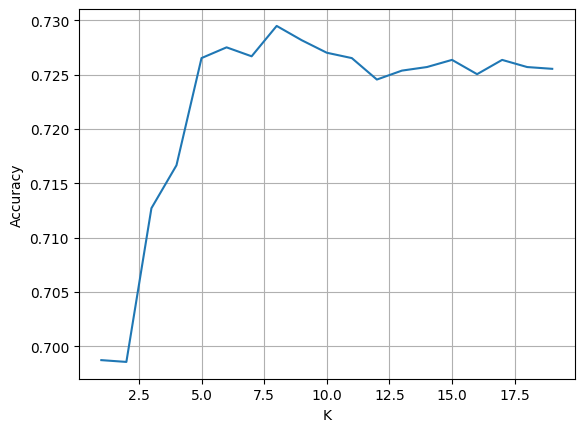
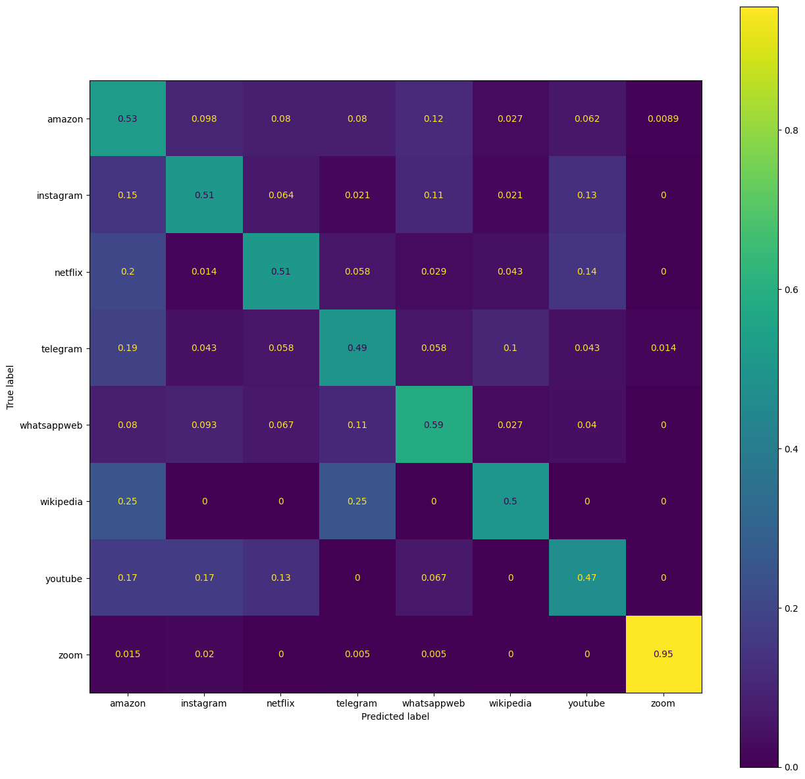
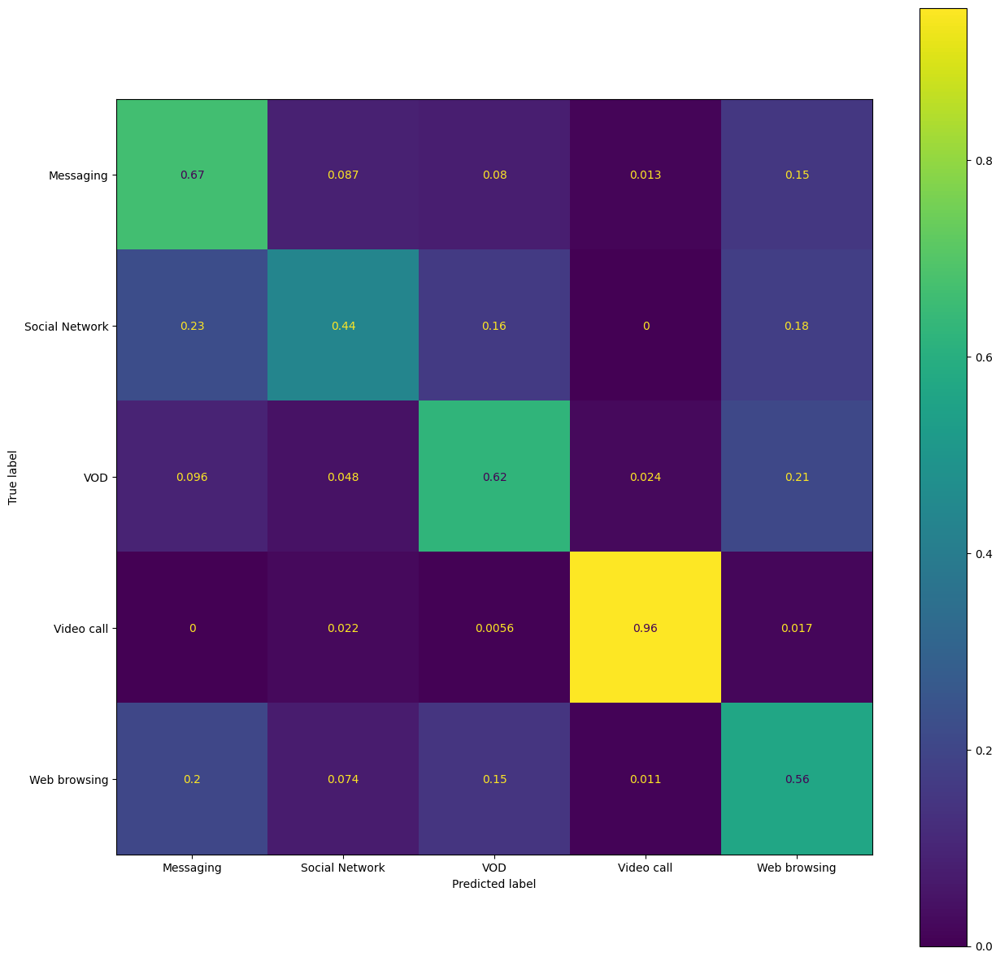

# WiFi Encrypted Traffic Classification

**Authors:** Mattia Fiore, Pasquale Lobaccaro

This repository hosts the code and documentation for a project focused on **classifying encrypted WiFi traffic** using Machine Learning techniques. The goal is to identify the application generating the traffic (e.g., Netflix, YouTube, Zoom) solely based on packet statistics, without inspecting the encrypted payload.

## 📂 Project Structure

* **`Wireless_Project.ipynb`**: The main Jupyter Notebook containing the data processing pipeline, feature engineering, and the implementation of the K-Nearest Neighbors (KNN) classification algorithm.
* **`WiFi encrypted traffic classification.pdf`**: Detailed report describing the experimental setup, data capturing methodology, and analysis of results.

---

## 📡 Experimental Setup & Data Capture

To build the dataset, we set up a controlled testbed consisting of three devices:
1.  **Traffic Generator:** A MacOS device consuming content (Client).
2.  **Access Point:** An iOS device acting as a hotspot.
3.  **Sniffer:** A Linux (Ubuntu) machine in **Monitor Mode** capturing traffic on a specific channel (e.g., Channel 6).

> **[INSERT IMAGE HERE]:** *Place a diagram or photo of your experimental setup (the 3 devices).*
> ``

### Targeted Applications
We captured and analyzed traffic from 8 popular applications:
* Netflix
* YouTube
* WhatsApp Web
* Telegram Web
* Instagram Web
* Zoom
* Amazon
* Wikipedia

---

## 🧠 Methodology

The project uses a **K-Nearest Neighbors (KNN)** classifier to distinguish between traffic types.

### Feature Extraction
Instead of Deep Packet Inspection (DPI), which is ineffective on encrypted traffic, we utilized statistical features derived from the packet flow, such as:
* Average data length (Uplink/Downlink)
* Standard deviation of data length
* Inter-arrival times

### Classification Strategy
We experimented with different configurations:
1.  **Grouped vs. Ungrouped:** Analyzing apps individually vs. grouping similar types (e.g., Social Networks).
2.  **Dataset Refinement:** We observed that `Amazon` and `Wikipedia` traffic features were overlapping significantly with others. Removing them improved the model's performance.

---

## 📊 Results

The model performance was evaluated using **Cross-Validation** and **Confusion Matrices**.

* **Best Configuration:** Ungrouped dataset (excluding Amazon and Wikipedia).
* **Metric:** Euclidean Distance.
* **Best Accuracy:** **75.3%**
* **Optimal K:** **9**







---

## 🛠️ Requirements

To run the analysis code, you need Python 3 and the following libraries:

```bash
pip install pandas numpy matplotlib scikit-learn
```

## 🚀 Usage

Clone the repository.

Ensure you have the captured dataset (if not included directly in the repo, specify where to place the CSV files).

Run the notebook:
```bash
    jupyter notebook Wireless_Project.ipynb
```
The notebook will output the accuracy plots and classification reports.

## 📄 Reference

For a complete understanding of the methodology and detailed analysis, please refer to the Project Report (PDF) included in this repository.